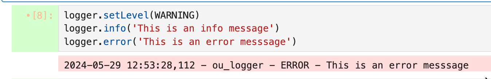

# Accessibility Features

Accessibility is good for everyone. Several tools are included in the extension pack that support accessibility:

- light and dark mode themes are offered as part of the JupyerLab/Notebook UI but additional themes can also be installed via the [jupyterLab-theme](https://github.com/topics/jupyterlab-theme) extension.

- the [`jupyterlab_cell_status_extension`](https://github.com/innovationOUtside/jupyterlab_cell_status_extension) provides visual and audible alerts relating to cell run status:

- visual indication of cell run status in cell margin;
- visual indication of cell run completion via cell flash;
- audible alerts, relating to cell execution, spoken announcement of execution errors.

## Additional tools offering audio support

Although not part of the extension pack, installing the [`ou-logger`](https://github.com/innovationOUtside/ou-logger-py/) Pyhton package into a Jupyter Pyhton kernel provides support for audible and visual logging messages.

These messages can be used to informally track progress of code execution by reporting waypoints, variable values, etc.

