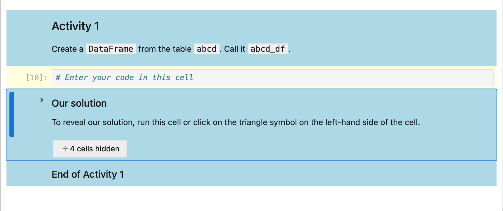
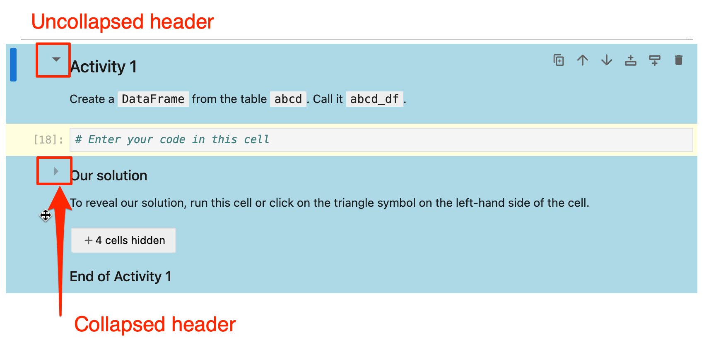
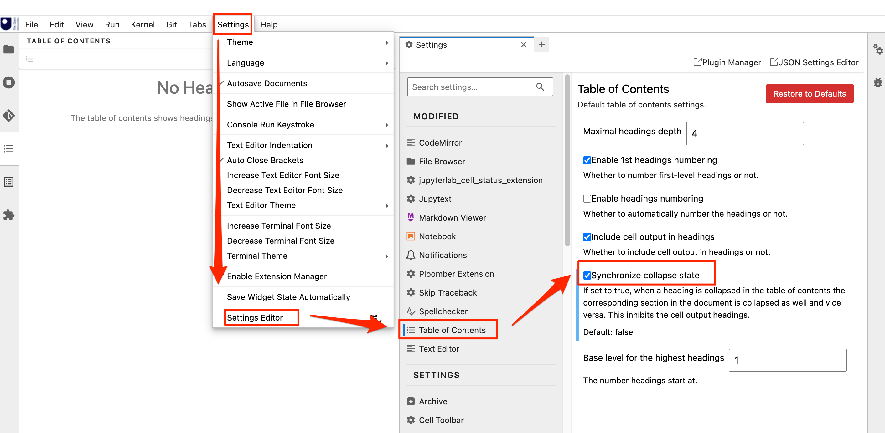

# Exercises

The TIM351 notebooks manages notebooks in the following ways:

- colour styling of notebooks using the [`jupyterlab-empinken-extension`](https://innovationoutside.github.io/ou-tm351-jl-extensions/user-interface-support.html#notebook-cell-tools)

- folded / hidden answers.

The notebooks are styled using the blue / `Activity` colouring to mimic activity styling in the VLE. "Call-to-action" cells, where students are expected to make some changes to the cell, are highlighted using the yellow / `Learner` styling;

Answers are collapsed using the in-built "collapsible headings" feature of JupyterLab/notebook v7 notebooks. (Cells with metadata `"jp-MarkdownHeadingCollapsed": true` and that start with a heading are automatically collapsed.)

Selecting a markdown cell that starts with a header will show a collapsed/uncollapsed indicator. Click it to collapse / uncollapse the cell. A collapsed header will collapse all the cells below until the next heading of the same level.

In the TM351 notebooks, when working in a subsection (heading level 2), we use headers typically at level 3 (`### Activity N`) for the activity and level 4 (`#### Answer`) for the answer.

You can also uncollapse the cell by clickng the `+ N cells hidden` button.

*The cell immediately following the end of the set of cells you want to be collapsed, e.g. cells under a level 4 __must__ start with a header of at least the same level as the answer heading.*

Collapsed cells can optionally be synchronised across the table of contents widget and the notebook via the *Table of Contents* settings from the `Settings > Settings Editor` menu.

## Automatically Collapsing Answer Cells When Distributing Notebooks

The `tm351_nb_utils` Python package includes a command line tool ([`nb_collapse_activities`](https://github.com/innovationOUtside/nb_workflow_tools/?tab=readme-ov-file#ensure-activity-answer-cells-are-collapsed)) that will automatically collapse activity solutions in notebook files according to the heuristics:

- is the cell styled as an empinke activity (i.e. does it have the `style-activity` cell tag set); and
  - does the heading start with `Our solution` or `Answer`;

The tool acts by adding `"jp-MarkdownHeadingCollapsed": true` to cell metadata.

Note: the `tm351_nb_utils` package includes several other tools for managing notebook quality.
