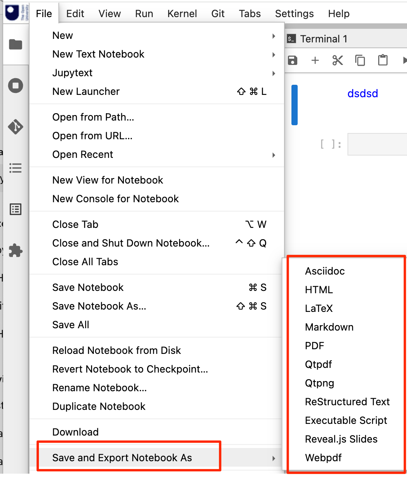

# Jupyter Menus

By default, the JupyterLab *Save and Export Notebook As* menu option lists all the export formats supported by nbconvert whether or not the tools capable of performing the conversions are installed. From the nbconvert docs:

>The export format to be used, either one of the built-in formats
>[‘asciidoc’, ‘custom’, ‘html’, ‘latex’, ‘markdown’, ‘notebook’, ‘pdf’, ‘python’, ‘qtpdf’, ‘qtpng’, ‘rst’, ‘script’, ‘slides’, ‘webpdf’] or a dotted object name that represents the import path for an Exporter class ( https://nbconvert.readthedocs.io/en/latest/config_options.html )




We can manually remove the unsupported options by editing `~/.jupyter/jupyter_notebook_config.py` and adding:

```text
c.MarkdownExporter.enabled = False
c.ASCIIDocExporter.enabled = False
c.LatexExporter.enabled = False
c.PDFExporter.enabled = False
c.QtPDFExporter.enabled = False
c.QtPNGExporter.enabled = False
c.RSTExporter.enabled = False
c.WebPDFExporter.enabled = False
```

The suggestion is that should be able to put this into a `ContainerConfig.yml` in the form:

```yaml
jupyter_server_config:
  MarkdownExporter.enabled: False
```

but this is as yet untested.