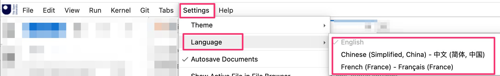
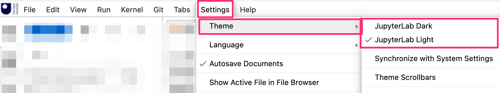
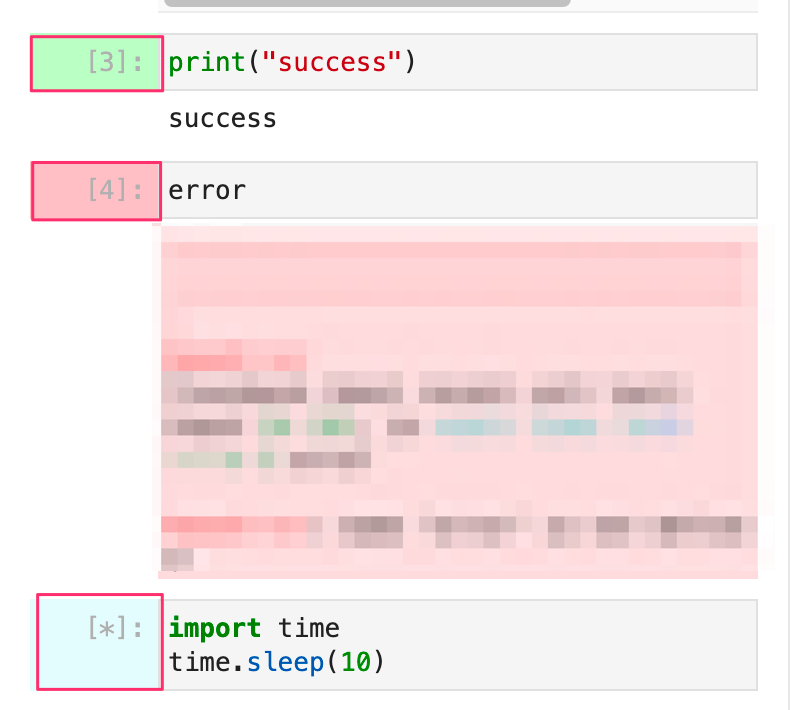
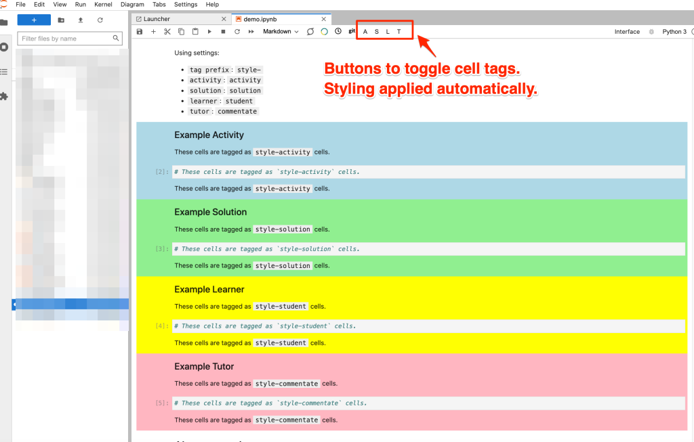
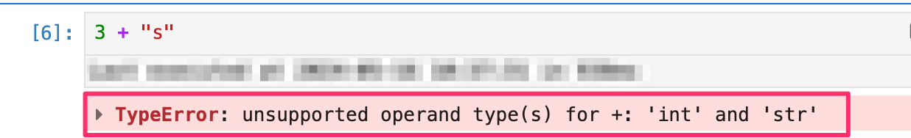

# User Interface Support

The package bundles a variety of extensions that are intended to provided an improved user-experience when using the Juptyer user environment.

## Branding and OU extensions

- `jupyterlab-ou-brand-extension = "^0.2.0"` [[repo](https://github.com/innovationOUtside/jupyterlab_ou_brand_extension/)]: add OU branding to a JuptyerLab and Jupyter nptebook v7 environment

## Language packs

A wide variety of langauge packs are available that can be used to customise the JupyterLab user interface labels. *The language pack can be set from the `Settings > Language` menu option.*

The following language packs are installed by default by this package:

- `jupyterlab-language-pack-fr-fr = "^4.1.post2"`: French language pack;
- `jupyterlab-language-pack-zh-cn = "^4.1.post2"`: Chinese language pack

A wide variety of other language packas are also available: [JupytereLab language packs](https://github.com/jupyterlab/language-packs/tree/main/language-packs).

## Themes

By default, JupyterLab ships with two default themes - a "light" them and a "dark" theme. *The theme can be set from the `Settings > Theme` menu option, which also provides tools for changing the default code and content font size*.

A wide variety of third party themes are also available: [JupyterLab themes](https://github.com/topics/jupyterlab-theme).

## Notebook cell tools

- `jupyterlab-cell-status-extension = "^0.1.3"` [[repo](https://github.com/innovationOUtside/jupyterlab_cell_status_extension)]: provide a visual indication of cell run status; also includes additional accessibility tools, such as audible alerts, relating to cell execution;

- `jupyterlab-empinken-extension = "^0.5.0"`[[repo](https://github.com/innovationOUtside/jupyterlab_empinken_extension)]: adds the ability to colour the cell background using configurable cell tags; also provides optional toolbar buttons for tagging selected cells appropriately; 

Colours can be set via extensions preferences.

- `jupyterlab-skip-traceback = "^5.1.0"` *(for use with Python notebook kernel)* [[repo](https://github.com/deshaw/jupyterlab-skip-traceback)]: allow Python error reports to be displayed in a collapsed view when a run cell generates an error; *note that this extension has suboptimal default settings; see elsewhere for recommended settings.*

- `jupyterlab-myst = "^2.4.0"` [[repo](https://github.com/executablebooks/jupyterlab-myst)]: adds MyST markdow parser support for markdown cells to enable richer styling of markdown content;

- `jupyterlab-spellchecker = "^0.8.4"` [[repo](https://github.com/jupyterlab-contrib/spellchecker)]: spellchecker; the config file also supports the inclusion of additional dictionary terms.
